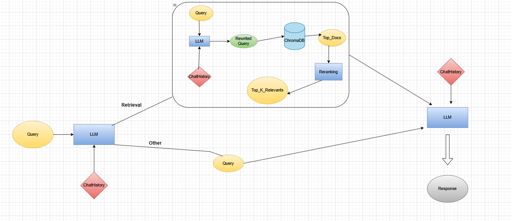
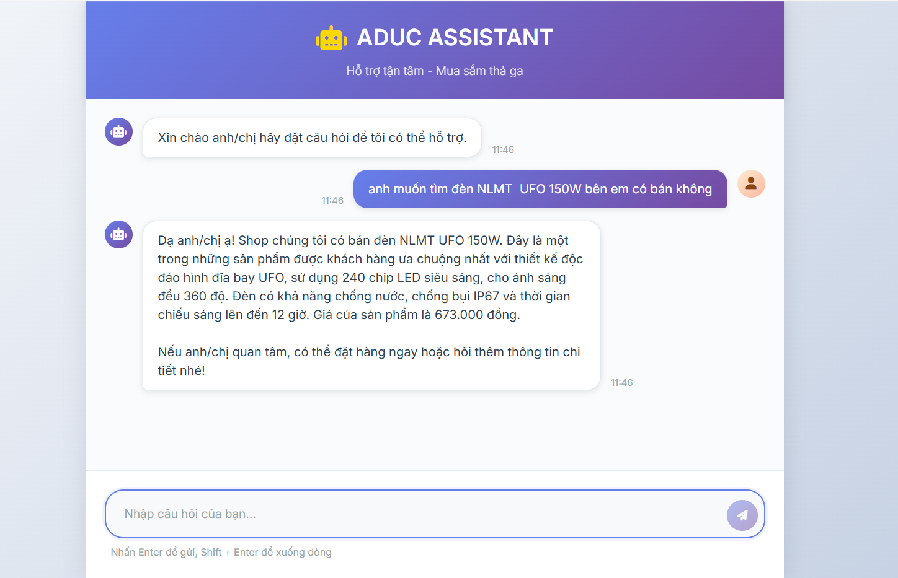

# RAG_saler
## 1. Project Description

**.** Real-time AI Chatbot Application for customer support, providing product information and answering inquiries.<br>
**.** Approaches used:<br>
Query rewriting, Function calling, Hybrid search, Reranking, Few-shot prompting

## 2. Tree Project
```
RAG_saler
├─ app.py
├─ data
│  └─ data_final_NORMAL.xlsx
├─ demo.png
├─ flow_chard.png
├─ Interface_gradio.py
├─ main.py
├─ README.md
├─ requirements.txt
├─ src
│  ├─ chroma_store.py
│  └─ interface
│     ├─ home.html
│     ├─ script.js
│     └─ style.css
└─ utils
   ├─ process_chat_history.py
   ├─ prompt_template.py
   └─ reranker.py

```
## 3.FlowChart + Demo
### FlowChart



### Demo



## 4. Installation
### 1. Clone the respository
```
git clone https://github.com/ducankk4/RAG_saler.git
```
### 2. Install requirements
```
pip install -r requirements.txt
```
### 3. Starting chatbot
```
urvicon app:app --reload
```
